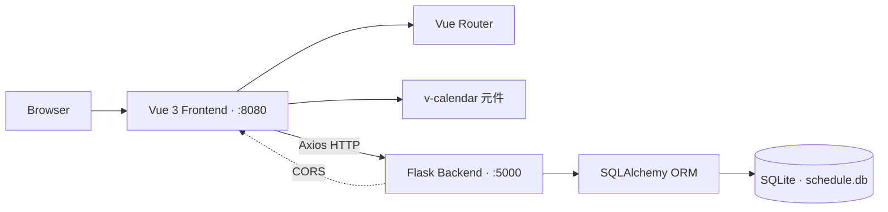

# Personal Schedule Manager

> Full-stack 個人行程管理 web app · Vue 3 前端 + Flask 後端 + SQLite

**Author**: [@Lee-unhn](https://github.com/Lee-unhn) · a2264563@gmail.com

## 專案簡介 / Overview

一個前後端分離的個人行程／待辦事項管理應用。前端用 Vue 3 + `v-calendar` 提供互動式日曆，後端用 Flask + SQLAlchemy + SQLite 提供 RESTful CRUD API。整體採深色主題設計。

## 架構 / Architecture



## 技術棧 / Tech Stack

**Backend**
- Python / Flask
- SQLAlchemy ORM + SQLite
- Flask-CORS

**Frontend**
- Vue.js 3
- Vue Router (頁面導覽)
- Axios (與後端通訊)
- v-calendar (日曆元件)

## 主要檔案 / Key Files

- `backend/app.py` · Flask app + REST API + SQLAlchemy 模型
- `backend/requirements.txt` · Python 依賴
- `backend/instance/schedule.db` · SQLite 資料庫 (自動建立)
- `frontend/` · Vue 3 SPA (`npm run serve` 啟動)
- `frontend/babel.config.js` · Babel 設定

## 功能 / Features

- **行程儀表板** · 日曆 + 任務列表整合，顯示今日／本週重要任務
- **互動式日曆** · 日期上以不同顏色圓點標示優先級，點日期篩選當天行程
- **任務列表** · 按優先級／日期／時間排序，區分已完成/未完成
- **CRUD** · 彈出式 Modal 新增/編輯，可設內容/日期/時間/優先級（高中低），可一鍵標完成、刪除
- **深色主題** · 整體科技感深色 UI

## 使用 / Usage

需要分別啟動後端和前端。

### 1. 啟動後端 (Backend)

```bash
cd backend

# (建議) 建虛擬環境
# python -m venv venv
# venv\Scripts\activate

pip install -r requirements.txt
python app.py
```

後端運行在 `http://localhost:5000`。首次執行會自動建立資料庫檔案。

### 2. 啟動前端 (Frontend)

```bash
cd frontend
npm install
npm run serve
```

前端運行在 `http://localhost:8080` (或終端提示的其他埠號)。在瀏覽器開啟即可使用。

## License

Unlicensed (personal project) — 若要使用請先聯絡作者。
